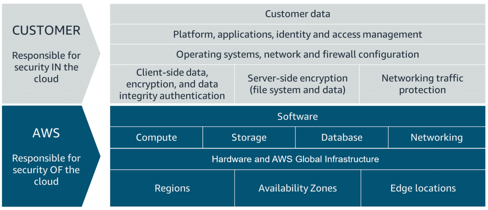

# Modelo de Responsabilidade Compartilhada da AWS

O Modelo de Responsabilidade Compartilhada da AWS é um framework que define as responsabilidades de segurança e conformidade da AWS e de seus clientes. Ele divide as responsabilidades em duas categorias:

### Responsabilidades da AWS (Segurança da Nuvem)

1. **Segurança Física:**
   - A AWS é responsável pela segurança física dos data centers. Isso inclui proteger as instalações, controlar o acesso e garantir que o hardware esteja protegido contra ameaças físicas.

2. **Segurança da Infraestrutura:**
   - A AWS gerencia a infraestrutura que inclui hardware, software, rede e instalações que executam os serviços da AWS Cloud. Isso inclui a manutenção dos servidores, armazenamento e equipamentos de rede.

3. **Segurança de Rede:**
   - A AWS é responsável por proteger a infraestrutura de rede global que conecta os data centers. Isso inclui garantir a comunicação segura entre os data centers e proteger contra ataques de rede.

4. **Camada de Virtualização:**
   - A AWS gerencia o hipervisor e a tecnologia de virtualização subjacente que permite que várias máquinas virtuais sejam executadas em um único servidor físico.

### Responsabilidades do Cliente (Segurança na Nuvem)

1. **Segurança dos Dados:**
   - Os clientes são responsáveis pela segurança de seus dados. Isso inclui criptografia de dados, integridade dos dados e confidencialidade dos dados. Os clientes devem garantir que seus dados estejam criptografados tanto em repouso quanto em trânsito.

2. **Gerenciamento de Identidade e Acesso (IAM):**
   - Os clientes devem gerenciar o acesso e as permissões dos usuários usando o AWS IAM. Isso inclui criar e gerenciar usuários, grupos, funções e políticas do IAM para controlar quem pode acessar os recursos e quais ações podem ser realizadas.

3. **Segurança de Aplicações:**
   - Os clientes são responsáveis por proteger suas aplicações que estão sendo executadas na AWS. Isso inclui garantir que as aplicações estejam livres de vulnerabilidades, implementar práticas de codificação segura e atualizar e corrigir regularmente o software.

4. **Configuração de Rede:**
   - Os clientes devem configurar suas próprias configurações de rede, como configurações do Virtual Private Cloud (VPC), grupos de segurança e listas de controle de acesso (ACLs). Isso inclui configurar firewalls, VPNs e outras medidas de segurança de rede.

5. **Configuração do Sistema Operacional e Software:**
   - Os clientes são responsáveis por gerenciar os sistemas operacionais e o software que estão sendo executados em suas máquinas virtuais. Isso inclui instalar atualizações, patches e configurar as configurações de segurança.

6. **Monitoramento e Registro:**
   - Os clientes devem implementar monitoramento e registro para detectar e responder a incidentes de segurança. A AWS fornece serviços como Amazon CloudWatch e AWS CloudTrail para ajudar com o monitoramento e registro.

### Representação Visual

Aqui está uma representação visual do Modelo de Responsabilidade Compartilhada da AWS:

| Responsabilidades da AWS   | Responsabilidades do Cliente       |
|----------------------------|------------------------------------|
| Segurança Física           | Segurança dos Dados                |
| Segurança da Infraestrutura| Gerenciamento de Identidade e Acesso (IAM) |
| Segurança de Rede          | Segurança de Aplicações            |
| Camada de Virtualização    | Configuração de Rede               |
|                            | Configuração do Sistema Operacional e Software |
|                            | Monitoramento e Registro           |

---

# AWS Shared Responsibility Model

The AWS Shared Responsibility Model is a framework that outlines the security and compliance responsibilities of AWS and its customers. It divides responsibilities into two categories:

### AWS Responsibilities (Security of the Cloud)

1. **Physical Security:**
   - AWS is responsible for the physical security of the data centers. This includes securing the facilities, controlling access, and ensuring that the hardware is protected from physical threats.

2. **Infrastructure Security:**
   - AWS manages the infrastructure that includes the hardware, software, networking, and facilities that run AWS Cloud services. This includes maintaining the servers, storage, and networking equipment.

3. **Network Security:**
   - AWS is responsible for protecting the global network infrastructure that connects the data centers. This includes ensuring secure communication between data centers and protecting against network attacks.

4. **Virtualization Layer:**
   - AWS manages the hypervisor and the underlying virtualization technology that allows multiple virtual machines to run on a single physical server.

### Customer Responsibilities (Security in the Cloud)

1. **Data Security:**
   - Customers are responsible for the security of their data. This includes data encryption, data integrity, and data confidentiality. Customers must ensure that their data is encrypted both at rest and in transit.

2. **Identity and Access Management (IAM):**
   - Customers must manage user access and permissions using AWS IAM. This includes creating and managing IAM users, groups, roles, and policies to control who can access resources and what actions they can perform.

3. **Application Security:**
   - Customers are responsible for securing their applications running on AWS. This includes ensuring that applications are free from vulnerabilities, implementing secure coding practices, and regularly updating and patching software.

4. **Network Configuration:**
   - Customers must configure their own network settings, such as Virtual Private Cloud (VPC) settings, security groups, and network access control lists (ACLs). This includes setting up firewalls, VPNs, and other network security measures.

5. **Operating System and Software Configuration:**
   - Customers are responsible for managing the operating systems and software running on their virtual machines. This includes installing updates, patches, and configuring security settings.

6. **Monitoring and Logging:**
   - Customers should implement monitoring and logging to detect and respond to security incidents. AWS provides services like Amazon CloudWatch and AWS CloudTrail to help with monitoring and logging.

### Visual Representation

Here is a visual representation of the AWS Shared Responsibility Model:

| AWS Responsibilities        | Customer Responsibilities         |
|-----------------------------|-----------------------------------|
| Physical Security           | Data Security                     |
| Infrastructure Security     | Identity and Access Management (IAM) |
| Network Security            | Application Security              |
| Virtualization Layer        | Network Configuration             |
|                             | Operating System and Software Configuration |
|                             | Monitoring and Logging            |

---

# Modelo de Responsabilidad Compartida de AWS

El Modelo de Responsabilidad Compartida de AWS es un marco que describe las responsabilidades de seguridad y cumplimiento de AWS y sus clientes. Divide las responsabilidades en dos categorías:

### Responsabilidades de AWS (Seguridad de la Nube)

1. **Seguridad Física:**
   - AWS es responsable de la seguridad física de los centros de datos. Esto incluye asegurar las instalaciones, controlar el acceso y garantizar que el hardware esté protegido contra amenazas físicas.

2. **Seguridad de la Infraestructura:**
   - AWS gestiona la infraestructura que incluye el hardware, software, redes e instalaciones que ejecutan los servicios de AWS Cloud. Esto incluye el mantenimiento de los servidores, el almacenamiento y el equipo de redes.

3. **Seguridad de la Red:**
   - AWS es responsable de proteger la infraestructura de red global que conecta los centros de datos. Esto incluye garantizar la comunicación segura entre los centros de datos y proteger contra ataques de red.

4. **Capa de Virtualización:**
   - AWS gestiona el hipervisor y la tecnología de virtualización subyacente que permite que múltiples máquinas virtuales se ejecuten en un solo servidor físico.

### Responsabilidades del Cliente (Seguridad en la Nube)

1. **Seguridad de los Datos:**
   - Los clientes son responsables de la seguridad de sus datos. Esto incluye la encriptación de datos, la integridad de los datos y la confidencialidad de los datos. Los clientes deben asegurarse de que sus datos estén encriptados tanto en reposo como en tránsito.

2. **Gestión de Identidad y Acceso (IAM):**
   - Los clientes deben gestionar el acceso y los permisos de los usuarios utilizando AWS IAM. Esto incluye crear y gestionar usuarios, grupos, roles y políticas de IAM para controlar quién puede acceder a los recursos y qué acciones pueden realizar.

3. **Seguridad de Aplicaciones:**
   - Los clientes son responsables de asegurar sus aplicaciones que se ejecutan en AWS. Esto incluye garantizar que las aplicaciones estén libres de vulnerabilidades, implementar prácticas de codificación segura y actualizar y parchear regularmente el software.

4. **Configuración de la Red:**
   - Los clientes deben configurar sus propias configuraciones de red, como configuraciones de Virtual Private Cloud (VPC), grupos de seguridad y listas de control de acceso (ACL). Esto incluye configurar firewalls, VPNs y otras medidas de seguridad de red.

5. **Configuración del Sistema Operativo y Software:**
   - Los clientes son responsables de gestionar los sistemas operativos y el software que se ejecutan en sus máquinas virtuales. Esto incluye instalar actualizaciones, parches y configurar las configuraciones de seguridad.

6. **Monitoreo y Registro:**
   - Los clientes deben implementar monitoreo y registro para detectar y responder a incidentes de seguridad. AWS proporciona servicios como Amazon CloudWatch y AWS CloudTrail para ayudar con el monitoreo y registro.

### Representación Visual

Aquí hay una representación visual del Modelo de Responsabilidad Compartida de AWS:

| Responsabilidades de AWS    | Responsabilidades del Cliente     |
|-----------------------------|-----------------------------------|
| Seguridad Física            | Seguridad de los Datos            |
| Seguridad de la Infraestructura | Gestión de Identidad y Acceso (IAM) |
| Seguridad de la Red         | Seguridad de Aplicaciones         |
| Capa de Virtualización      | Configuración de la Red           |
|                             | Configuración del Sistema Operativo y Software |
|                             | Monitoreo y Registro              |

---

