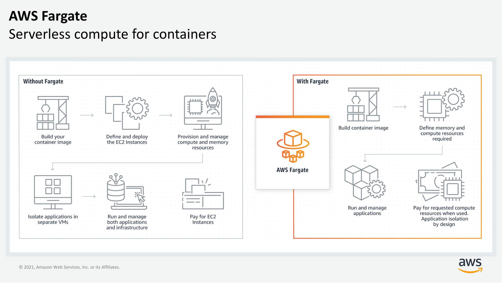

# AWS Fargate: Serverless Compute for Containers

AWS Fargate transforms the way you run containerized applications by abstracting the underlying compute infrastructure. Whether you’re using Amazon ECS or Amazon EKS, Fargate lets you focus on application development while AWS manages the heavy lifting.

---

## 1. Recap: Container Orchestration & Compute Platforms

Before diving into Fargate, remember these key points:

- **Container Orchestrators:**  
  - **Amazon ECS** and **Amazon EKS** manage your container lifecycle by handling tasks such as scheduling, scaling, and defining container tasks or pods.
  
- **Traditional Compute Approach:**  
  - Typically, containers run on clusters of EC2 instances. This gives you tight control over the compute environment but means you are responsible for provisioning, patching, scaling, and managing cluster capacity.
  
- **Why Serverless for Containers?**  
  - EC2 is not serverless. For workloads that don’t require low-level management of instances, a serverless compute platform offloads these responsibilities and enables you to focus solely on your application.

---

## 2. What is AWS Fargate?

**AWS Fargate** is a purpose-built, serverless compute engine for containers. It simplifies container deployment by eliminating the need to manage the underlying infrastructure. Here’s what you need to know:

- **Abstracted Compute Infrastructure:**  
  - Fargate abstracts the EC2 instance—there’s no need to choose, provision, or patch servers. AWS allocates the right amount of compute based on your task or pod definition.

- **Use Familiar ECS/EKS Concepts:**  
  - You continue using the same Amazon ECS APIs, task definitions, and Kubernetes constructs (if using EKS) without a steep learning curve.

- **Native AWS Integrations:**  
  - **Identity and Access Management (IAM):** Seamlessly secure your container workloads with fine-grained permissions.
  - **Amazon Virtual Private Cloud (VPC):** Launch Fargate containers inside your VPC to control network connectivity and security. Each container can be assigned its own elastic network interface (ENI) for isolation.

- **Key Features at a Glance:**
  - **Serverless Compute Engine:** No EC2 instances to manage.
  - **Scalable and Managed:** AWS handles scaling, fault tolerance, and infrastructure management.
  - **Workload Isolation & Improved Security:** Designed for secure, isolated container deployments.
  - **ECS and EKS Support:** Compatible with your choice of container orchestrator.
  - **Pay-as-You-Go:** Only pay for the vCPU, memory, and storage your containers consume.

---

## 3. How AWS Fargate Works

Deploying containers with Fargate follows a streamlined workflow:

1. **Build and Store Your Container Images:**  
   - Create your container image and push it to a repository such as [Amazon Elastic Container Registry (ECR)](https://aws.amazon.com/ecr/).

2. **Define Your Application Requirements:**  
   - In your ECS task definition or EKS pod specification, set the memory, CPU, networking, and storage requirements for your container.

3. **Deploy Your Containers:**  
   - Launch your containerized application on Fargate. AWS handles the complete underlying infrastructure lifecycle—provisioning, patching, scaling, and managing fault tolerance.

4. **Cost Efficiency:**  
   - Pay only for the compute resources your containers consume. Fargate supports flexible pricing options such as Spot pricing and Compute Savings Plans to help optimize costs.

---

## 4. Pricing and Flexibility

AWS Fargate is designed with a cost-effective, usage-based pricing model:

- **Cost Model:**  
  - You’re billed only for the vCPU, memory, and storage resources that your containers actually use—there’s no cost for managing idle infrastructure.

- **Flexible Pricing Options:**  
  - Fargate supports pricing models similar to EC2, including Spot Instances and Compute Savings Plans, offering further flexibility in managing your container workloads.

---

## 5. Use Cases for AWS Fargate

AWS Fargate is versatile and suits a variety of container use cases:

- **Microservice Architectures:**  
  - Deploy and scale individual microservices without managing the underlying servers.
  
- **Batch Processing:**  
  - Run background jobs or batch processes with scalable compute resources.
  
- **Machine Learning Applications:**  
  - Deploy containerized ML workflows with built-in fault tolerance and scalability.
  
- **Cloud Migrations:**  
  - Migrate on-premises applications by containerizing them and shifting to a serverless platform, reducing operational overhead.

---

## 6. Resources

For more detailed information on AWS Fargate and serverless computing, please refer to these resources (links will open in a new tab):

- **AWS Website: AWS Fargate**  
  [https://aws.amazon.com/fargate/?c=ser&sec=srv](https://aws.amazon.com/fargate/?c=ser&sec=srv)

- **AWS Website: Getting Started with Serverless Computing**  
  [https://aws.amazon.com/serverless/resources/?serverless.sort-by=item.additionalFields.createdDate&serverless.sort-order=desc](https://aws.amazon.com/serverless/resources/?serverless.sort-by=item.additionalFields.createdDate&serverless.sort-order=desc)

- **External Site: Coursera Course – Building Modern Python Applications on AWS**  
  [https://www.coursera.org/learn/building-modern-python-applications-on-aws](https://www.coursera.org/learn/building-modern-python-applications-on-aws)

---

## Conclusion

AWS Fargate revolutionizes container management by providing a fully managed, serverless compute engine that removes the burden of managing EC2 instances and cluster capacity. With familiar ECS and EKS integrations, native support for IAM and VPC, and a pay-as-you-go pricing model, Fargate enables you to focus on developing and scaling your applications securely and efficiently.

*Would you like to see an illustrative diagram of the Fargate deployment workflow or a detailed side-by-side comparison of running containers on EC2 versus using Fargate?*
