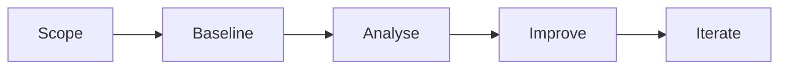

# How to Run an AWS Well-Architected Framework Review  
*A soup-to-nuts playbook for practitioners — and a cram sheet for the AWS SAA-C03 exam.*

---

## Table of Contents  
1. [Introduction](#introduction)  
2. [Prerequisites](#prerequisites)  
3. [Step-by-Step Review Workflow](#step-by-step-review-workflow)  
4. [High-Risk Issue Playbook](#high-risk-issue-playbook)  
5. [Pillar Cheat-Sheets](#pillar-cheat-sheets)  
6. [Governance & Multi-Account Strategy](#governance--multi-account-strategy)  
7. [Sustainability Spotlight](#sustainability-spotlight)  
8. [Tools & Lenses Appendix](#tools--lenses-appendix)  
9. [Critical Analysis & Common Pitfalls](#critical-analysis--common-pitfalls)  
10. [SAA-C03 Exam Tips](#saa-c03-exam-tips)  
11. [References](#references)  
12. [Changelog](#changelog)  

---

## Introduction  
The AWS Well-Architected Framework (WAF) distills years of operational experience into six pillars: Operational Excellence, Security, Reliability, Performance Efficiency, Cost Optimization, and Sustainability. A **Well-Architected Review (WAR)** uses a structured questionnaire (~60 questions) to benchmark a workload against these pillars, grade risks, and generate an improvement plan. The AWS Well-Architected Tool (WA Tool) in the console automates the whole process, from scoping to report export.

---

## Prerequisites  

| Requirement | Why It Matters | Quick Check |
|-------------|----------------|-------------|
| **Clear workload definition** | Keeps scope tight; one production workload per review. | Architecture diagram & list of business KPIs ready. |
| **Cross-functional team** | Perspectives from ops, security, finance, and dev. | Names on calendar invite. |
| **WA Tool enabled** | Central place to document answers & export JSON. | Console → *Well-Architected Tool* → *Enable*. |
| **Access to metrics & dashboards** | Evidence beats opinions. | CloudWatch, X-Ray, Cost Explorer dashboards shared. |
| **Remediation budget & timeline** | HRIs must be fixed fast. | Funding source identified (e.g., WA Partner credits). |

---

## Step-by-Step Review Workflow  

| Phase | Actions | Output |
|-------|---------|--------|
| **1. Scope** | • Define workload. • Gather docs & KPIs. • Identify stakeholders. | Confirmed scope sheet. |
| **2. Baseline** | • Answer pillar questions in WA Tool. • Attach evidence links (logs, diagrams). | Raw risk scores, HRIs highlighted. |
| **3. Analyse** | • Categorize risks. • Map to business impact. • Prioritize fixes (HRI → ≤30 days). | Draft Improvement Plan. |
| **4. Improve** | • Create tickets (JIRA / AWS ProServe template). • Track progress. • Schedule follow-up review. | Remediated workload; updated WAR status. |
| **5. Iterate** | • Run game days. • Re-review on major releases. • Embed WAF in sprint retros. | Continuous compliance. |

---

## High-Risk Issue Playbook  

| Risk Level | Definition | Target Fix Window | Example |
|------------|------------|-------------------|---------|
| **HRI (High)** | Any critical best-practice is unmet. | ≤ 30 days | No encryption at rest for PII. |
| **Medium** | Important but not critical. | ≤ 90 days | Under-utilised RI coverage. |
| **Low** | Nice-to-have improvements. | Backlog | Tagging consistency gaps. |

---

## Pillar Cheat-Sheets  

### Operational Excellence  
*Design Principles*  
- Perform **operations as code** (IaC via CloudFormation).  
- Make **small, reversible changes** (blue/green with CodeDeploy).  
- **Learn from all events** (run game days, post-mortems).

*Key Services*  
`CloudFormation`, `CodeDeploy`, `AWS Config`, `CloudWatch Synthetics`.

---

### Security  
*Design Principles*  
- **Least privilege** (IAM, SCPs).  
- **Protect data in transit & at rest** (TLS 1.2+, KMS keys).  
- **Prepare for incidents** (runbooks, AWS S3 immutable backups).

*Key Services*  
`AWS IAM`, `KMS`, `Secrets Manager`, `Security Hub`, `GuardDuty`.

---

### Reliability  
*Design Principles*  
- **Automate recovery** (Auto Scaling, self-healing).  
- **Test recovery procedures** (chaos engineering).  
- **Scale horizontally** (stateless tiers, cell architectures).

*Key Services*  
`Route 53`, `Elastic Load Balancer`, `S3 Multi-Region Access Points`, `DynamoDB global tables`.

---

### Performance Efficiency  
*Design Principles*  
- **Right-size** (Graviton, instance families).  
- **Use serverless & managed services** (Lambda, Fargate).  
- **Go global** (CloudFront, Global Accelerator).

*Key Services*  
`Lambda@Edge`, `ElastiCache/DAX`, `Aurora Serverless v2`, `Glue`.

---

### Cost Optimization  
*Design Principles*  
- **Adopt a consumption model** (serverless, spot).  
- **Measure overall efficiency** (Cost Explorer, Budgets alarms).  
- **Stop spending on undifferentiated heavy lifting** (managed DBs).

*Key Services*  
`Savings Plans`, `Compute Optimizer`, `Instance Scheduler`, `S3 Intelligent-Tiering`.

---

### Sustainability  
*Design Principles*  
- **Maximize utilisation** (higher CPU %, container packing).  
- **Choose energy-efficient hardware** (Graviton/Inferentia).  
- **Select greener Regions** (lower carbon intensity).  

*Key Services*  
`AWS Customer Carbon Footprint Tool`, `Auto Scaling`, `EventBridge` (for power-off schedules).

---

## Governance & Multi-Account Strategy  

1. **AWS Organizations** for workload isolation.  
2. **Service Control Policies (SCPs)** to enforce guardrails (e.g., deny public S3).  
3. **AWS Control Tower** to bootstrap landing zones quickly.  
4. **Tagging standards** → drive Cost Explorer & automated compliance checks.  

---

## Sustainability Spotlight  
SAA-C03 now tests the 6th pillar:  
- Prefer managed services (shared responsibility reduces your carbon slice).  
- Use **Graviton** instances: up to 60 % less energy for the same workload.  
- Schedule non-prod to sleep (EventBridge cron + AWS Instance Scheduler).  

---

## Tools & Lenses Appendix  

| Tool / Lens | Purpose | Exam Gotcha |
|-------------|---------|-------------|
| **Well-Architected Tool** | Conduct, share, and export reviews. | Free, pillar-aligned, supports custom lenses. |
| **Trusted Advisor** | Account-wide checks on cost, security, limits. | Covers 5 pillars, but *not* a structured WAR. |
| **Serverless Lens** | Extra Qs on cold starts, idempotency. | Know retry & DLQ patterns. |
| **SaaS Lens** | Multi-tenant isolation. | Understand tenant-aware throttling. |
| **Analytics Lens** | Data partitioning, encryption. | Kinesis vs. MSK trade-offs. |
| **Migration Lens** | Re-host vs. re-factor decisions. | Snowball vs. DataSync for bulk moves. |

---

## Critical Analysis & Common Pitfalls  

| Gap to Watch | Why It Hurts | Fix |
|--------------|-------------|-----|
| Skipping evidence | Answers become opinions; exam expects data-driven. | Attach CloudWatch metrics, diagrams. |
| Ignoring Sustainability | New pillar — easy exam points lost. | Add Graviton & sleep schedules. |
| Confusing WA Tool with Trusted Advisor | Different scopes & outputs. | Memorize comparison matrix above. |
| Vague remediation timelines | HRIs linger; partner funding blocked. | Set 30/90-day targets. |

---

## SAA-C03 Exam Tips  

1. **Know pillar design principles verbatim** — many scenario questions map directly.  
2. **Contrast WA Tool vs. Trusted Advisor** — expect at least one.  
3. **Lens scenarios**: Serverless cold-start mitigation (provisioned concurrency), SaaS tenant isolation (scoped IAM roles).  
4. **Sustainability**: pick managed, right-size, choose green regions.  
5. **Risk remediation math**: HRIs ≤ 30 days, medium ≤ 90 days, low = backlog.  
6. **Governance nuance**: SCPs vs. IAM policies; Control Tower vs. Landing Zone DIY.  
7. **Cost questions**: Savings Plans vs. RIs, Spot vs. On-Demand trade-offs.  

---

## References  
- AWS Well-Architected Tool – Deep Dive (Skill Builder Lesson)  
- AWS Well-Architected Framework Whitepaper (2024 update)  
- AWS Docs: WA Tool User Guide, Control Tower, Sustainability Pillar  

---

## Changelog  

| Date (UTC) | Version | Change Description | Source |
|------------|---------|--------------------|--------|
| 2025-06-04 | 1.0 | Initial directive scaffold. | — |
| 2025-06-13 | 1.1 | Added pillar cheat-sheets, WA workflow, sustainability, exam tips, Trusted Advisor matrix. | Conversation synthesis +  |